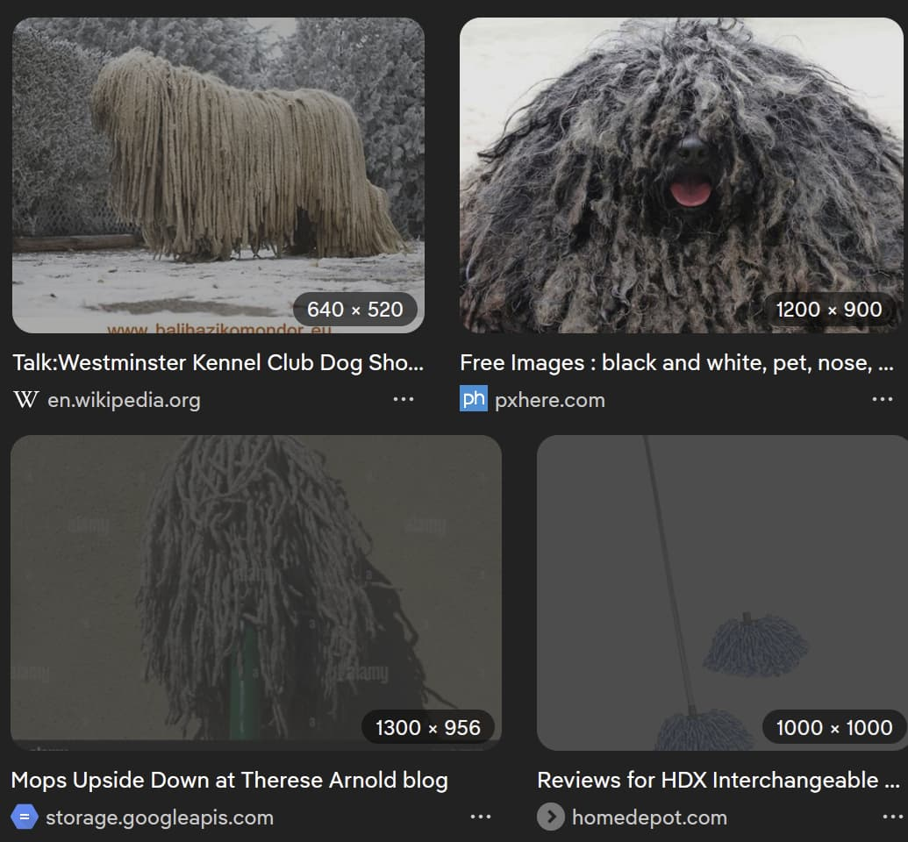

**Firefox only.** This extension does not work on other browsers.

Block unwanted images and browse only the Komondors you love.

1. Train a model at https://teachablemachine.withgoogle.com/train/image
2. Import the model from the image-blocker settings page
3. Images are classified locally in your browser

This project was built with claude-code.
